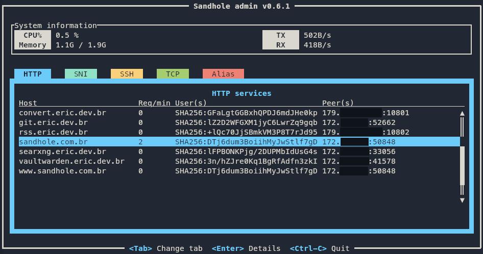

# Administration

Sandhole has a couple of SSH-based options for administrators to interact with and monitor their Sandhole instance.

## Admin interface

Sandhole comes with a command-line admin interface available through SSH, which displays information about the system and proxied connections. In order to access it, you must be a [user with admin credentials](./configuration.md#adding-users-and-admins).

To access it, simply run the command:

```bash
ssh -p 2222 -t sandhole.com.br admin
```

where `sandhole.com.br` is your hostname and `2222` is Sandhole's SSH port.



Via the admin interface, it's possible to see basic metrics, inspect services, and remove users.

## Admin-only aliases

Sandhole also has built-in functionality that exposes sensitive endpoints via [local forwarding](./local_forwarding.md). Only users with administrative capabilities are able to alias to them.

All of them follow the naming convention `<service>.sandhole:10`, and can be found in the aliasing tab of the admin interface. Note that remote forwarded aliases are not allowed to use port 10 for this reason.

These are the available admin-only aliases:

- **prometheus.sandhole:10** exposes a single Prometheus endpoint at the root, for integrating telemetry data with monitoring dashboards.
