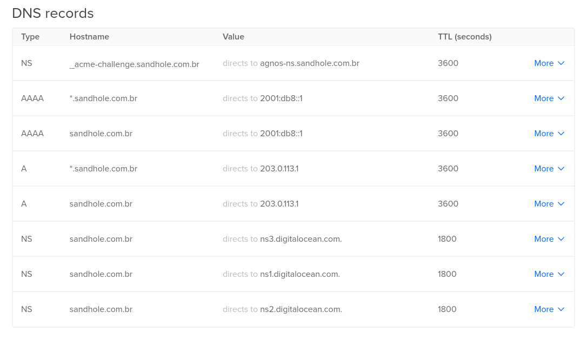

# Quick start

In order to run Sandhole, you'll need:

- A server with at least one public address. This tutorial assumes that you're using Linux.
- Control over a domain name (for example, `sandhole.com.br`) and its subdomains (`*.sandhole.com.br`).

## 1. Configure your DNS

Make sure to point the `A` and `AAAA` records to your server's IP address(es). If you intend to use Agnos (recommended), also set an `NS` record for `_acme-challenge.sandhole.com.br` to `agnos-ns.sandhole.com.br` (or any other domain that will reach your Sandhole instance).

How to set up your DNS records depends on your choice of DNS provider. For example, on DigitalOcean, this is what the configuration might look like:



## 2. Get the executable

Download a copy of the latest release:

```bash
# x64
wget --output-document sandhole https://github.com/EpicEric/sandhole/releases/latest/download/sandhole-linux-amd64
#
# -- OR --
#
# AArch64
wget --output-document sandhole https://github.com/EpicEric/sandhole/releases/latest/download/sandhole-linux-arm64
```

If you prefer, you may also use [Docker Compose](./docker_compose.md) (recommended) or [compile the binary yourself](./compiling_from_source.md).

## 3. Run Sandhole

You can now run Sandhole! Just make sure that it points to your domain:

```bash
./sandhole --domain sandhole.com.br
```

By default, this will expose ports 80 (for HTTP), 443 (for HTTPS), and 2222 (for SSH). If it all succeeds, you should see the following:

```log
[2024-11-03T13:10:51Z INFO  sandhole] Starting Sandhole...
[2024-11-03T13:10:51Z INFO  sandhole] Key file not found. Creating...
[2024-11-03T13:10:51Z INFO  sandhole] Listening for HTTP connections on port 80.
[2024-11-03T13:10:51Z INFO  sandhole] Listening for HTTPS connections on port 443.
[2024-11-03T13:10:51Z INFO  sandhole] Listening for SSH connections on port 2222.
[2024-11-03T13:10:51Z INFO  sandhole] Sandhole is now running.
```

Now you're ready to dig sandholes like a crab! 🦀
